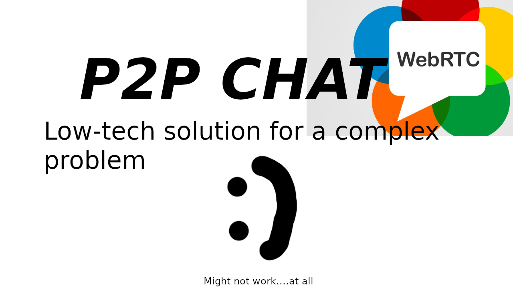
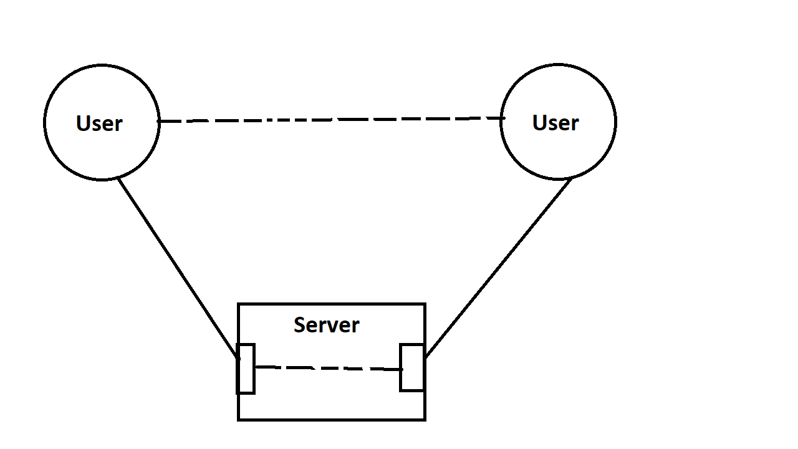
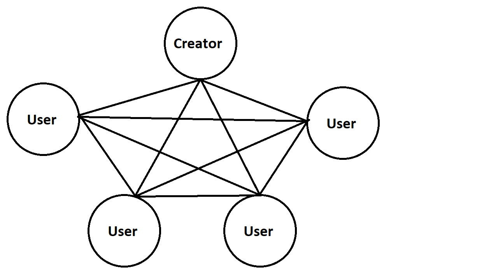
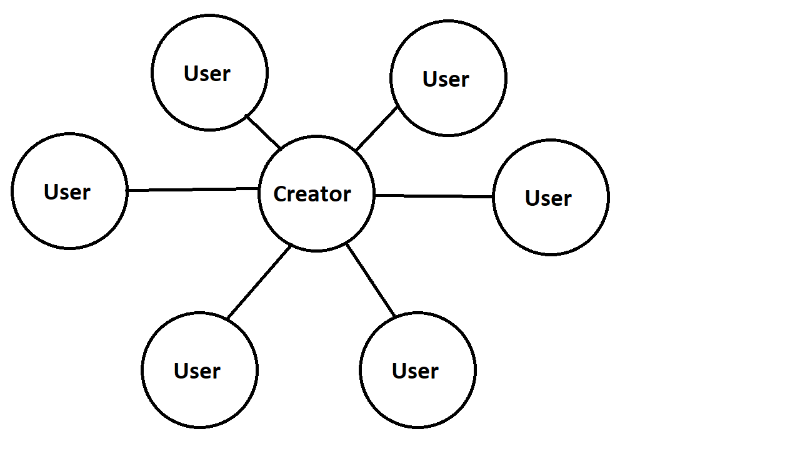
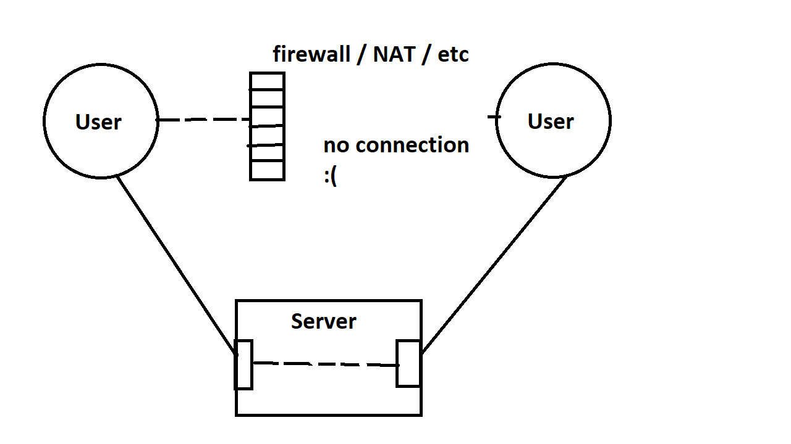
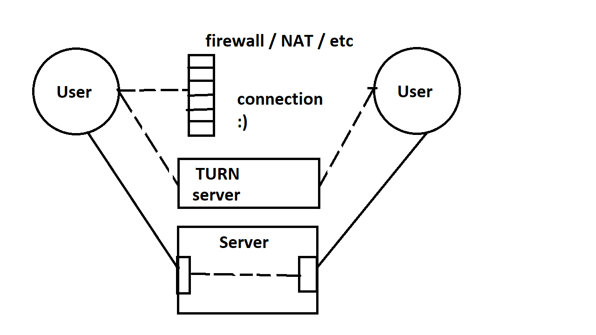

# P2PChat

P2PChat is a WebRTC utilizing webapp that is able to form mesh-like and SFU-like connections with other clients to transfer data between them.

### Features
- Rooms
- Messaging
- Creation of video/voice calls
- Screensharing
- Transfer of files
### How to use it?
1. Download both [P2PChat](https://github.com/miksme/P2PChat) and [P2PChat-server](https://github.com/miksme/P2PChat-server) projects
2. Copy `default_config.ts` to `config.ts` and change it to your liking
3. Pray to God that your network is not NATed or get a working [TURN server](https://github.com/coturn/coturn)
4. Download all the required modules (with `yarn install` unless you enjoy a dependency hell)
5. Build P2PChat ( `npm run build`/`yarn build`/etc. )
6. Build P2PChat-server ( `npm run build`/`yarn build`/etc. )
7. Copy `P2PChat/build/*` to `P2PChat-server/build/app/views`
8. Run P2PChat-server ( `npm start`/`yarn start`/etc. )
9. Open whatever hostname and port was set in browser
### How does it work?
Data communication is done over WebRTC (with [simple peer](https://github.com/feross/simple-peer)) and the webserver is used to keep a record of active rooms aswell as to signal events (with socket.io) like a user joining or leaving.  
Said signaling is also used to establish WebRTC connections between users by using the server to passthrough `signal` messages

### What room type to use?
When creating a room a choice will be given - Mesh type of SFU type  
#### Mesh:

- Every single client is connected to every other client
- If the creator of the room leaves everyone else can still communicate
- Sometimes more reliable
- Connected users use more resources on average than they would on SFU
- Will face problems if too many clients connect
#### SFU server:

- Every client is connected to the creator of the room
- If the creator of the room leaves everyone else **cannot** communicate - the room becomes "dead"
- More resource easy on the connected clients
- The creator of the room will need to provide all streams and process them and so will face the highest load.
- Allows for more users than a Mesh-type would

After the room is established other users will be able to connect to it.
## Problems with connection
If no STUN server is provided the connection will not be established since that is how WebRTC works*

However if no TURN server is provided some clients will still be able to connect to one another. If one cannot it is most likely due to firewall settings/ being in a NATed network.

To fix this issue NAT traversal can be used (and this requires a TURN server)

### Are there any unit tests?
No
### What about usable documentation?
No
### And can a browser tab really be made to be a SFU server? 
Probably...  
### Does this project use "SFU" correctly?
Nope  
The `SFUServer` class does not implement a lot of things to follow the definition of an "SFU server" (to my knowledge) but I think that it is close enough and im not renaming all instances of SFU to something else
